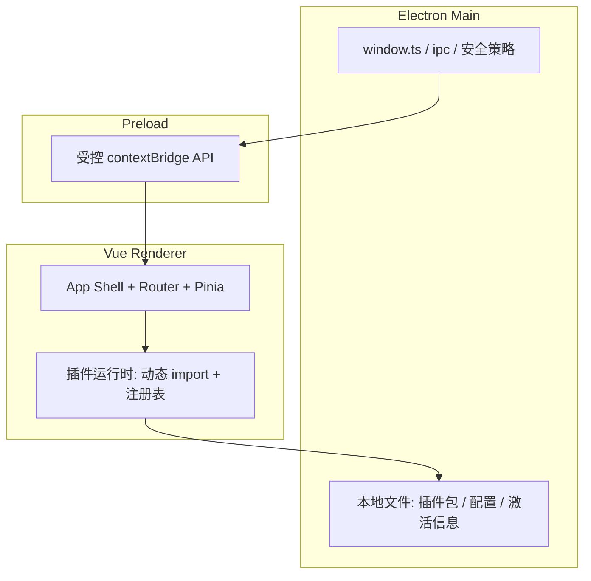

# Unions Moni Tool — 项目框架文档

> **产品定位**：跨平台（Windows / Linux）桌面端 **HTTP / TCP 协议模拟器**，以 **Electron + Vue 3 + TypeScript** 为核心，**Tailwind CSS** 负责原子化布局与令牌化样式，**Element Plus** 提供可访问的复杂控件（表格、表单、对话框等）。  
> **本文档性质**：架构与交互的**框架级说明**，用于指导实现与评审；具体 API 命名可在落地时微调，但**插件契约、菜单结构、打包目标**应保持一致。

---

## 1. 目标与非目标

### 1.1 目标

- 提供可扩展的**模拟能力**：通过**插件式功能包**在首页以**卡片**形式挂载能力入口。
- 提供统一的**工具配置**入口（含**功能包导入**）、**帮助**（关于我们、注册激活）。
- 支持**深色模式**为默认体验，并允许**浅色 / 深色 / 系统**切换。
- 产出可分发安装包：**Windows `.exe`**、**Linux `.deb`**、**macOS `.dmg`（Apple Silicon arm64）**。

### 1.2 非目标（首版可不做）

- 在 **iOS（iPhone/iPad）** 上发布（Electron 不支持；本项目 macOS 指桌面 `.dmg`）。
- 将插件运行在完全隔离的浏览器沙箱中（首版以**进程内 ESM 动态加载 + 最小权限**为主，见安全策略）。

---

## 2. 技术栈与版本建议

| 层级 | 选型 | 说明 |
|------|------|------|
| 运行时 | Electron | 主进程窗口、系统集成、文件对话框 |
| 渲染 | Vue 3 + `<script setup>` + TypeScript | 组合式 API，类型安全 |
| 路由 | Vue Router | 首页、各功能页、配置、帮助 |
| 状态 | Pinia | 主题、已加载插件、激活状态等 |
| 样式 | Tailwind CSS v3+ | 与 design tokens 对齐，避免魔法数 |
| 组件库 | Element Plus | 深色主题与表单/表格能力 |
| 构建 | Vite + `electron-vite`（推荐）或等价方案 | 主进程 / 预加载 / 渲染分离构建 |
| 打包 | `electron-builder` | `nsis` → exe，`deb` → deb |

**版本策略**：锁定 `package.json` 中 major 版本；升级 Electron 前需回归 **原生模块** 与 **Node API** 使用点。

---

## 3. 默认视觉与主题（对齐 `.cursor/skills/impeccable`）

本工具默认用户为**长时间盯屏的工程师/测试人员**，首屏默认 **深色**；视觉方向采用 **「深空观测台 + 精密仪器」**：冷静、克制、信息密度高，但**有明确主色与层次**，避免「通用 AI 仪表盘」的紫蓝渐变、霓虹描边、左侧粗色条等套路。

### 3.1 设计原则（摘自 impeccable 技能的可执行要点）

- **配色**：以 **OKLCH** 定义品牌色与中性色；中性色向品牌色相**微染色**（极低 chroma 即可），避免纯灰飘在色面上。
- **深色默认**：浅色文字在深色底上**略增行高**（约 +0.05～0.1），减轻阅读发飘感。
- **字体**：产品 UI 使用 **固定 `rem` 字号阶梯**（非营销页的 fluid clamp）；**展示/标题字体**与**正文字体**成对出现，且避免技能中列出的「反射字体」清单（如 Inter、Syne、Space Grotesk 等常见 AI 默认）。
- **布局**：4pt 基座间距语义化 token（`--space-sm` 等），用 `gap` 控制兄弟间距；卡片**不要**套娃；避免「Hero 大数字 + 三列 KPI」模板。
- **绝对禁止的廉价套路**（实现时 CSS 审查）：`border-left/right` 宽大于 1px 的彩色竖条；`background-clip: text` + 渐变填充文字。

### 3.2 主题切换

- **三种模式**：`light` | `dark` | `system`（监听系统 `prefers-color-scheme`）。
- **实现策略**：
  - 根节点 `class` / `data-theme` 驱动 Tailwind `dark:` 与 CSS 变量。
  - Element Plus 使用 `dark` 类名策略或 `ConfigProvider` + 主题变量，与 **Tailwind 令牌** 同源，避免两套颜色漂移。
- **默认**：首次启动为 `dark`；用户选择持久化到本地（如 `electron-store` 或 JSON）。

### 3.3 「最酷炫」的落点（可记忆点）

- **一处**高质量入场动效（例如首页卡片 stagger，**仅** `transform` / `opacity`），其余交互保持短促清晰。
- **主色**只用于关键操作与状态，遵守 **60/30/10** 的视觉权重感（而非像素占比）。

---

## 4. 总体架构



- **主进程**：窗口生命周期、打开文件/目录、读取用户数据目录下插件、校验签名（若后续有）、IPC。
- **预加载**：`contextBridge` 暴露**白名单** API（读插件目录、导入包、持久化配置），**禁止** `nodeIntegration` 直接进渲染进程。
- **渲染进程**：Vue 应用 + 插件注册中心；插件以 **ESM** 形式加载。

---

## 5. 信息架构与导航

### 5.1 顶层菜单（与需求一致）

| 一级 | 二级 | 行为 |
|------|------|------|
| **首页功能** | 与**已加载插件**动态一致（每个插件一条） | 进入对应插件主页面（或首页卡片聚焦该插件） |
| **工具配置** | **导入功能**（及后续可扩展：网络、代理、证书等） | 进入配置页 |
| **帮助** | **关于我们**、**注册激活** | 进入对应静态/半静态页 |

### 5.2 左上角悬浮菜单交互（规格）

- **位置**：窗口**左上角**固定悬浮（`position: fixed` + 安全区），不占用传统顶栏标题位时可与自定义标题栏并存（Electron 可选 `frame: false` 时由你实现拖拽区）。
- **一级菜单**：点击触发器后，**向左展开**一级菜单面板（如从左侧滑入或自触发器向左延伸，动画 180–240ms，ease-out-quart）。
- **二级菜单**：鼠标**点击**某一一级项后，**在该项下方**展开二级（向下展开）；再次点击同一一级项可收起二级（手风琴逻辑）或点击其他一级项切换。
- **进入功能**：点击**二级菜单项** → `vue-router` 导航到对应路由；**首页**始终可通过「首页」或 Logo 返回。

> 实现提示：可用「单例 Popover + 嵌套子菜单」或自研分层面板；需保证键盘可达（Escape 关闭、焦点陷阱）。

---

## 6. 首页：卡片化与插件嵌入

### 6.1 布局

- **网格**：`grid-template-columns: repeat(auto-fit, minmax(280px, 1fr))`，响应式卡片。
- **每张卡片**对应一个已注册插件的**摘要**：名称、描述、主操作（进入模拟器）、状态（运行中/错误）。

### 6.2 导入功能包

- **入口**：`工具配置 → 导入功能`。
- **流程（建议）**：
  1. 用户选择 `.zip` 或包含 `manifest.json` 的目录（由主进程校验路径）。
  2. 解压/复制到用户数据目录下 `plugins/<pluginId>/`。
  3. 渲染进程通过 **动态 `import()`** 加载入口 ESM（见下节）。
  4. 注册成功后，**首页功能**一级菜单与 **首页卡片** 同步更新。

---

## 7. 插件标准（ESM）

### 7.1 包结构（约定）

```
plugin-name/
  manifest.json          # 元数据与入口
  dist/index.mjs         # ESM 构建产物（或 index.js，须为 ESM）
  assets/                # 可选
```

### 7.2 `manifest.json` 字段（最小集）

| 字段 | 类型 | 说明 |
|------|------|------|
| `id` | `string` | 全局唯一，kebab-case |
| `name` | `string` | 展示名 |
| `version` | `string` | semver |
| `entry` | `string` | 相对 manifest 的 ESM 入口，如 `./dist/index.mjs` |
| `permissions` | `string[]` | 如 `["network"]`, `["fs.read"]` 等，供后续沙箱扩展 |

### 7.3 入口模块导出契约（TypeScript 接口）

宿主应用**只**通过以下**具名导出**与插件交互（可扩展，但需版本化）：

```typescript
// src/shared/plugin-contract.ts（建议路径）
import type { Component } from 'vue'

export interface PluginMeta {
  id: string
  name: string
  version: string
  description?: string
}

/** 首页卡片摘要 */
export interface HomeCardDescriptor {
  title: string
  subtitle?: string
  badge?: string
}

/** 插件必须提供的 API */
export interface ProtocolSimulatorPlugin {
  meta: PluginMeta
  /** 首页卡片展示 */
  homeCard: HomeCardDescriptor
  /** 卡片点击后进入的主视图（Vue 组件） */
  MainView: Component
  /** 可选：小型配置面板 */
  SettingsView?: Component
}
```

### 7.4 加载方式

- 使用 `import(/* webpackIgnore: true */ fileUrl)` 或 Vite 支持的 `import(meta.resolve)` 方案，将**绝对路径**转为 `file://` URL（注意 Windows 路径）。
- 失败时：在 UI 显示可读错误，**不**阻塞整个应用。

### 7.5 安全与信任（首版基线）

- 仅导入用户明确选择的目录中的插件；**记录**插件路径与版本。
- 预加载层限制可调用 Node API 的范围；后续可引入**清单签名**与**子进程隔离**。

---

## 8. 路由建议

| 路径 | 名称 | 说明 |
|------|------|------|
| `/` | Home | 卡片网格 |
| `/plugin/:pluginId` | Plugin | 动态插件主视图 |
| `/settings/import` | Import | 导入功能包 |
| `/settings/...` | Settings | 其他配置项 |
| `/help/about` | About | 关于我们 |
| `/help/license` | License | 注册激活 |

**路由与菜单**：`首页功能` 的二级项由 Pinia 中 `plugins[]` **派生**，与 `/plugin/:pluginId` 一致。

---

## 9. 工程目录（建议）

```
unions-moni-tool/
  electron/
    main/                 # 主进程
    preload/              # 预加载
  src/
    renderer/             # Vue 应用入口
    shared/               # 主/渲染共享类型（如 plugin-contract）
  plugins/                # electron-builder extraResources（如内置插件占位 manifest）
  docs/
    PROJECT_FRAMEWORK.md  # 本文档
  electron-builder.yml    # 或 package 内 builder 配置
```

---

## 10. 打包与产物

### 10.1 Windows

- **目标**：`nsis` 安装包（`.exe`），可选 `portable`。
- **注意**：代码签名证书（若有）在 CI 中注入密钥。

### 10.2 Linux

- **目标**：`deb`，依赖 `electron-builder` 的 `deb` 配置（`category`、`desktop` 入口等）。
- **注意**：`.deb` 与 `AppImage` 可二选一或并存；需求明确 **deb** 则优先保证 deb 安装与卸载路径正确。

### 10.3 构建命令（落地时写入 `package.json`）

- `pnpm run build`：类型检查 + Vite + Electron 打包。
- `pnpm run build:win` / `build:linux`：分平台 CI。

---

## 11. 验收清单（与本文档对齐）

- [ ] 深色为默认，**可切换**浅色 / 深色 / 系统，且 Element Plus 与 Tailwind 无色差断层。
- [ ] 首页 **卡片** 展示已加载插件；**导入功能包** 后新增卡片与菜单项。
- [ ] 左上角菜单：**左展一级 + 点击展开二级 + 进入页面** 行为符合第 5.2 节。
- [ ] 菜单结构：**首页功能（动态） / 工具配置（导入功能） / 帮助（关于、注册激活）**。
- [ ] 插件为 **ESM**，导出 `ProtocolSimulatorPlugin` 契约。
- [ ] 可构建 **exe** 与 **deb**。

---

## 12. 后续可选增强

- 插件热更新与版本迁移 (`migrate` 钩子)。
- HTTP/TCP 模拟共用**底层引擎**抽象，插件只暴露 UI 与场景配置。
- 遥测与崩溃报告（需隐私政策与开关）。

---

## 13. 打包版本与许可

构建时通过环境变量写入安装包元数据（见 `vite.config.ts` → `electron/main/build-meta.ts`）：

| 脚本 | 版本 | 行为 |
|------|------|------|
| `npm run build:win:official` | 正式版 | 首次启动起 **7 天体验**；可在「注册激活」输入密钥；过期后功能拦截并提示重新激活 |
| `npm run build:win:experience` | 体验版 | **不可激活**；有效期 = **打包时刻 + 规格**（`1h`/`1d`/`1m`/`1y`，默认 `1y`）；写入二进制，重装不延长；到期无法启动 |

| `npm run build:mac:official` | 正式版 | 同 Windows 正式版（Apple Silicon arm64 `.dmg`） |
| `npm run build:mac:experience` | 体验版 | 同 Windows 体验版（arm64 `.dmg`） |

也可直接：`node scripts/build-with-edition.mjs experience|official [win|linux|mac]`。详见 `docs/LICENSE_PACKAGING.md`。

激活码格式 `UNIONS-YYYYMMDD-XXXX`（日期为到期日，`XXXX` 为校验段）。内部生成示例：`formatActivationKey`（`electron/main/license.ts`）。

玖行桩模拟插件：**V2.25 协议在下拉中禁用**，默认仅可选 **V2.24**（`jx-protocol-policy.ts`）。

---

## 14. 参考技能文件

实现 UI 时除本文档外，应结合仓库内：

- `.cursor/skills/impeccable/SKILL.md` — 视觉与反模式禁令  
- `.cursor/skills/adapt/SKILL.md` — 窗口尺寸变化下的布局  
- `.cursor/skills/animate/SKILL.md` — 克制的动效  

---

*文档版本：1.1（框架级，含打包许可说明）*
