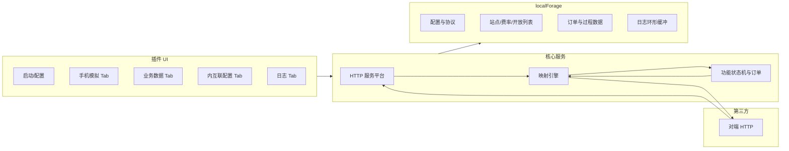

# 充电互联互通（内互联）模拟功能 — 设计文档

> **文档版本**：1.1  
> **日期**：2026-04-13  
> **依据协议**：[充电部分接口文档](./attachment/充电部分接口文档.md)（中电联 / 业务信息交换接口协议）  
> **宿主产品**：[项目框架说明](./PROJECT_FRAMEWORK.md)（Electron + Vue 3 + 插件体系）

---

## 1. 背景与目标

### 1.1 背景

内互联场景下，一方作为「服务平台」暴露标准 HTTP 接口，另一方作为「第三方」调用部分接口并实现对推送类接口的接收。真实联调成本高，需要在本地以**可配置协议映射**的方式模拟两端行为：同一套**功能域数据与操作**可通过映射 JSON 与中电联协议字段、接口名互转，从而支持多种协议扩展。

### 1.2 目标（当前实现）

- 提供**独立功能插件**（符合 `ProtocolSimulatorPlugin` 契约），使用 **localForage** 持久化配置、站点、订单、设备归属、日志索引等客户端数据。
- 内置 **HTTP 服务**（启动/停止、端口可配），实现协议文档中由**本平台扮演服务平台**时需实现的核心接口；向**第三方互联互通地址**发起调用类请求。
- 提供 **手机端扫码充电模拟** 与 **业务数据管理** 界面，以及 **内互联配置 CRUD** 与 **请求日志** 能力。
- 支持 **协议映射 JSON 导入与选择**；当前 HTTP 收发的验签与加解密逻辑按中电联标准固定实现，映射主要用于接口元信息与扩展。

### 1.3 非目标（首版）

- 不实现完整生产级安全审计与多租户隔离（仅单机工具级防护）。
- 不对 macOS 做专项适配（与项目框架一致，可后续扩展）。

---

## 2. 协议与角色对照

### 2.1 标准接口清单（摘自附件）

| 章节 | 接口名 | 典型角色 |
|------|--------|----------|
| 2.1 | `query_stations_info` | 第三方调用 → **服务平台实现** |
| 2.2 | `notification_stationStatus` | 服务平台调用 → **第三方实现** |
| 2.3 | `query_station_status` | 第三方调用 → **服务平台实现** |
| 2.4 | `query_station_stats` | 第三方调用 → **服务平台实现** |
| 2.5 | `query_equip_auth` | 第三方调用 → **服务平台实现** |
| 2.6 | `query_equip_business_policy` | 第三方调用 → **服务平台实现** |
| 2.7 | `query_start_charge` | 第三方调用 → **服务平台实现** |
| 2.8 | `notification_start_charge_result` | 服务平台调用 → **第三方实现** |
| 2.9 | `query_equip_charge_status` | 第三方调用 → **服务平台实现** |
| 2.10 | `notification_equip_charge_status` | 服务平台调用 → **第三方实现** |
| 2.11 | `query_stop_charge` | 第三方调用 → **服务平台实现** |
| 2.12 | `notification_stop_charge_result` | 服务平台调用 → **第三方实现** |
| 2.13 | `notification_charge_order_info` | 服务平台调用 → **第三方实现** |
| 2.14 | `check_charge_orders` | 服务平台调用 → **第三方实现** |
| 3.1 | `query_token` | 数据需求方调用 → **服务平台实现** |

**本模拟器当前约定**：

- **服务平台侧（本机 HTTP）**：当前已实现 `query_stations_info`、`query_start_charge`、`query_stop_charge`、`query_equip_charge_status`、`query_token` 的收包、验签、解密与应答签名。
- **第三方侧（对外调用）**：当前重点支持 `query_stations_info` 分页拉取；调用前先走 `query_token` 获取/刷新 token，后续请求带 `Authorization: Bearer <token>`。

附件中 `StartChargeSeqSta` 定义：**1 启动中；2 充电中；3 停止中；4 已结束；5 未知**（见 `query_start_charge` / `notification_start_charge_result` 等）。产品侧订单状态在下一章做语义扩展（挂起、待结算等），并与协议枚举对齐。

---

## 3. 协议映射 JSON

### 3.1 作用

- **协议元信息**：维护接口路径、方法、协议名称等，可导入扩展。
- **UI 协议选择**：每条对接可绑定协议 ID。
- **说明**：当前主流程（签名、加解密、路由提取）不依赖映射 JSON 动态字段映射。

### 3.2 建议结构（示例字段，落地时可调整）

```json
{
  "protocolId": "cec-union-v1",
  "protocolName": "中电联-标准交换",
  "version": "1.0.0",
  "endpoints": {
    "query_stations_info": { "path": "/query_stations_info", "method": "POST" }
  },
  "fieldMap": {
    "functionOrderId": ["StartChargeSeq", "OrderID"],
    "connectorId": ["ConnectorID"]
  },
  "envelope": {
    "operatorIdField": "OperatorID",
    "dataField": "Data",
    "encryptData": true
  }
}
```

- **导入**：配置中心支持上传 JSON 文件并校验 schema；导入后出现在「协议选择」下拉里。
- **内置**：可内置一份与附件字段一致的默认映射，便于零配置试用。

---

## 4. 功能架构



### 4.1 HTTP 服务

- **启动**：用户点击「启动服务」后绑定配置端口；未启动时部分能力禁用或提示。
- **基址**：`http://{本机 IP 或 127.0.0.1}:{port}/api/{对接唯一码 UUID}`  
  - 与「本地配置 · 请求地址」默认展示一致，便于复制到对端白名单。
- **路由**：接收 `/api/...` 下任意深度路径，固定取**最后两段**作为 `{linkUuid}/{action}`，兼容蛇形与驼峰动作名。
- **收包安全流程**（已实现）：
  1. 解析 `OperatorID/TimeStamp/Seq/Sig/Data`
  2. 依据请求 `OperatorID` 在本地/三方秘钥中选择候选（不匹配时回退双候选）
  3. 按 `OperatorID + Data + TimeStamp + Seq` 做 HMAC-MD5 验签
  4. 验签通过后用 AES-128-CBC（PKCS5/7）解密 Data
  5. 业务处理后按本地（服务平台）秘钥加密并签名响应

### 4.2 第三方调用客户端（对外）

- 使用「三方配置」中的 **互联互通地址（`interconnectionUrl`）** 作为对外根地址。
- `query_stations_info` 拉站前先检查 token 缓存：
  - 无 token / 过期 / 业务返回疑似 token 失效 → 先调 `query_token`
  - `query_token` 成功后写入 `thirdPartyTokenByLink[linkUuid]`
  - 拉站请求头带 `Authorization: Bearer <token>`
- 对 token 失效场景支持**清缓存后强制刷新并重试一次**。
- 所有对外请求（含失败）都会写入 outbound 日志（URL、请求体、响应体/错误）。

---

## 5. 界面信息架构

### 5.1 顶栏

| 控件 | 行为 |
|------|------|
| 启动服务 | 启动/停止 HTTP；状态灯展示监听地址 |
| 配置 | 抽屉/对话框：服务端口、默认日志条数、协议 JSON 导入与管理、当前选用协议 |

### 5.2 主体：左右分栏（当前实现）

**左侧（Tab）**

1. **扫码充电模拟**  
   - 站点列表（名称、地址摘要、费率摘要、开放状态）  
   - 扫码：调用摄像头或选择图片 → 二维码解析  
   - 解析成功后跳转 **实时充电页**（订单号、功率、电流电压、SOC、累计金额等）

2. **业务数据展示**  
   - **站点查看**：按对接分页展示已拉站点、关键字筛选、开放开关  
   - **订单查看**：订单列表、详情、过程数据（表格 + 电量/金额曲线）

**右侧（Tab）**

1. **内互联配置**：列表 + 新增/编辑/删除（见第 6 节）
2. **日志展示**：实时流式追加；类型、方向、着色、展开报文（见第 9 节）

---

## 6. 内互联配置（CRUD）

每条配置由三部分组成。

### 6.1 基本信息

| 字段 | 说明 |
|------|------|
| 对接名称 | 人工可读，区分多条配置 |
| 对接唯一码 | 16 位无分隔符 UUID（随机生成，不可与已有重复） |
| 协议 | 下拉，选项来自已导入的协议映射 JSON |

### 6.2 本地配置信息（本平台作为服务平台对外暴露）

| 字段 | 说明 |
|------|------|
| 平台编码 | 对应 `OperatorID` 等 |
| 请求地址 | 默认 `http://{访问本服务的 IP}:{端口}/api/{对接唯一码}`，可编辑 |
| OperatorSecret | 运营商秘钥 |
| SigSecret | 签名秘钥 |
| DataSecret | 数据加密秘钥 |
| DataSecretIV | 初始化向量 |

### 6.3 三方配置信息（对端平台）

字段与 6.2 类似，但**不再维护三方请求地址冗余项**，当前字段为：

- 平台编码
- 互联互通地址（`interconnectionUrl`）
- `OperatorSecret` / `SigSecret` / `DataSecret` / `DataSecretIV`

说明：历史数据中的 `thirdParty.requestBaseUrl` 会在加载时自动归一化迁移到 `interconnectionUrl`。

**校验**：保存前检查秘钥非空、URL 格式、唯一码唯一；秘钥在 UI 上可支持「仅显示掩码 + 重新录入」。

---

## 7. 站点与费率

- **同步来源**：选定一条内互联配置，执行「站点拉取」→ 对端 `query_stations_info` 分页拉取直至结束，合并入 `stationsByLink[linkUuid]`。
- **鉴权流程**：每次拉取前检查 token（按 link 缓存），必要时先请求 `query_token`。
- **费率拉取**：若映射中包含独立费率接口则调用；否则使用 `StationInfo` 内嵌费率描述字段展示。
- **开放站点**：用户在列表切换开放状态 → 手机模拟页仅展示已开放站点。
- **站点详情**：只读展示 `StationInfo` / `EquipmentInfo` / `ConnectorInfo` 结构（表格或描述列表）。
- **设备归属**：拉站后自动更新 `connectorMap`（`ConnectorID -> linkUuid/operatorId`），供扫码启动时路由。

---

## 8. 扫码充电流程

### 8.1 二维码解析

- **解析规则**（可配置项，首版可提供默认规则）：从二维码字符串提取 **充电设备接口编码**（`ConnectorID`）或与设备/枪绑定的业务 ID；若二维码含自定义段，对应协议 `query_start_charge` 的 `QRCode` 字段原文传入。
- **归属解析**：本地维护 `ConnectorID`（或解析出的设备号）→ **内互联配置 ID** 映射（来源于同步站点时的运营商与设备树）；若无法匹配则提示错误。

### 8.2 启动请求

- 根据枪 **ConnectorID**（及解析出的 `QRCode` 原文）在存储中解析归属对接；当前手机模拟默认发往本机 HTTP（`127.0.0.1:{port}`）走完整服务平台收包链路。
- 生成 `StartChargeSeq`（`运营商ID + 唯一编号`，27 字符，符合附件）。
- **联调语义**：附件规定 `query_start_charge` 为「第三方调用服务平台」。模拟时由本插件代表「第三方侧客户端」向**本机 HTTP 服务平台**发起该调用（即 POST 到本地 `query_start_charge` 映射路径，OperatorID 等使用**三方配置**中的平台编码与秘钥）；若对端提供独立联调入口，也可配置为先请求对端再由对端回调本机——以映射 JSON 中「启动链路」配置为准。启动成功后按第 9 节更新订单状态。

### 8.3 启动成功与实时页

- 同步返回 `SuccStat=0` 且状态进入充电流程后，进入实时充电页。
- 实时数据来自：`notification_equip_charge_status` / `query_equip_charge_status` 推送或轮询合并；展示字段与附件一致（功率可由电压×电流估算或直接使用推送电量差分）。

---

## 9. 订单状态机（产品态）

与协议 `StartChargeSeqSta` 对照使用，并增加 UI 所需状态。

| 产品状态 | 进入条件 | 说明 |
|----------|----------|------|
| 启动中 | 已下发 `query_start_charge`，等待结果 | 与协议 1 对齐 |
| 挂起 | 启动中超过 **2 分钟** 未收到「启动成功或充电中」的明确正向结果 | 扩展态 |
| 充电中 | 收到 `notification_start_charge_result` 且 `StartChargeSeqSta=2`，或过程推送表明充电中；**挂起**订单若收到充电中数据则**转入充电中** | 与协议 2 对齐 |
| 启动失败 | 启动结果明确失败或超时策略判定失败 | 扩展态 |
| 停止中 | 用户点击停止 → 下发 `query_stop_charge` | 与协议 3 对齐 |
| 待结算 | 收到 `notification_stop_charge_result`（停止成功）但**尚未**收到 `notification_charge_order_info` | 扩展态 |
| 已完成 | 收到订单信息 `notification_charge_order_info` | 与业务完成一致 |

**我的订单**列表按上述状态分栏或筛选；状态迁移写入订单记录并打时间戳。

---

## 10. 订单与过程数据（业务数据 Tab）

- **订单列表**：订单号、站点/桩/枪、当前状态、起止时间、金额摘要。
- **订单详情**：完整字段 + 关联配置 + 协议原始关键字段快照。
- **过程数据**：充电阶段收到的 `notification_equip_charge_status` / `query_equip_charge_status` 报文列表（时间、方向）；**图表**：时间-功率/累计金额等（前端图表库，数据来自过程表）。

---

## 11. 日志模块

| 项 | 说明 |
|----|------|
| 内容 | 时间、请求类型（接口名或功能名）、**方向**（接收 inbound / 向外 outbound）、摘要 |
| 交互 | 行点击展开 JSON 原文（脱敏可选：秘钥字段掩码） |
| 样式 | 方向或类型用不同颜色区分 |
| 容量 | 默认保留 **5000** 条（环形缓冲），可在「配置」中修改上限 |
| 过滤 | 按时间范围、方向、接口名、关键字搜索 Data 片段 |

日志与订单过程数据可共享底层存储或分表，避免重复磁盘占用。

---

## 12. 本地存储设计（localForage）

建议使用独立 **storeName** 前缀，例如 `cec-inner-link-{pluginId}`。

| 键前缀 | 内容 |
|--------|------|
| `protocols/` | 已导入协议映射 JSON 及元数据 |
| `settings/` | 端口、默认日志条数、当前协议 ID |
| `links/` | 内互联配置实体（基本信息 + 本地 + 三方） |
| `stations/` | 同步站点、开放标记、关联 linkId |
| `connectorOwner/` | ConnectorID → linkId / 设备元数据 |
| `orders/` | 订单主表与状态机字段 |
| `orderTimeline/` | 订单过程报文与采样点（供图表） |
| `logs/` | 日志环形队列索引 |
| `thirdPartyTokenByLink` | 按 linkUuid 缓存第三方 token（`accessToken`、`expiresAtMs`） |

大数据量时注意 **IndexedDB** 单库大小与批量写入节流（日志高频时合并 flush）。

---

## 13. 安全与隐私

- 秘钥仅存本机 IndexedDB，不上传。
- 日志默认包含完整报文，提供「一键清空」与导出前警告。

---

## 14. 依赖与插件契约

- **插件**：实现 `ProtocolSimulatorPlugin`（`meta`、`homeCard`、`MainView`；可选 `SettingsView` 若与全局配置拆分）。
- **新增依赖**：`localforage`；二维码：`html5-qrcode` 或 `jsQR` + 摄像头 API；图表按项目现有选型追加。

---

## 15. 验收要点（测试视角）

1. 导入映射 JSON 后可选协议并保存内互联配置，重启应用后数据仍在。  
2. 启动 HTTP 后，使用 Postman 调本地 `query_token`/`query_stations_info`：验签、解密、响应签名均可通过。  
3. 拉取站点时：无 token、过期 token、token 失效重试场景均可正常完成。  
4. 站点拉取后列表与开放逻辑在手机模拟页可见，`connectorMap` 可驱动扫码/手输启动。  
5. 扫码模拟能发起 `query_start_charge`，订单状态按第 9 节迁移，过程数据可视化正常。  
6. 日志条数上限、过滤、展开请求/响应报文可用。

---

## 16. 参考文档

- [充电部分接口文档](./attachment/充电部分接口文档.md) — 字段级定义与示例报文  
- [PROJECT_FRAMEWORK.md](./PROJECT_FRAMEWORK.md) — 插件与 Electron 约束  

---

**文档结束**
