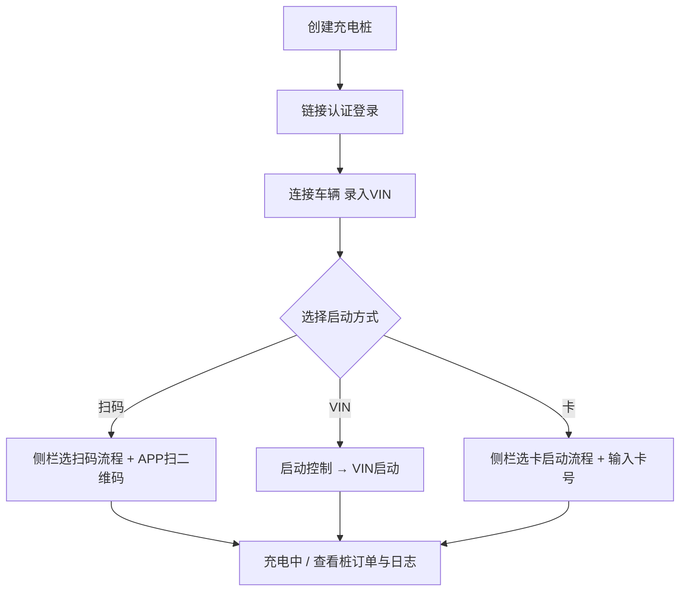

# 玖行桩用户手册

本文档说明 **Unions Moni Tool** 中 **玖行电桩模拟** 插件的日常使用方法，涵盖建桩、链接平台、扫码 / VIN / 卡启动等典型联调流程。

> 适用协议：内置 **玖行协议 V2.24**、**玖行协议 V2.25**。插件入口：首页 → **玖行电桩模拟**。

---

## 1. 界面概览

| 区域 | 说明 |
|------|------|
| 顶部工具栏 | **协议** 下拉（导入/导出协议包）、**设备搜索条件** 筛选桩 |
| **拓扑 / 列表** | 两种视图，功能一致 |
| 拓扑区左侧 **+** | **添加桩** |
| 桩图标 / 列表项 | 选中后右侧或侧栏显示详情 |
| 侧栏 Tab | **桩基本信息**、**桩控制**、**桩订单**、**日志** |
| 虚线车辆图标 | 连接车辆（录入 VIN） |
| **启动控制** 弹窗 | 扫码 / VIN / 卡三种启动方式 |

---

## 2. 创建充电桩

### 2.1 操作步骤

1. 打开 **玖行电桩模拟** 插件。
2. 点击 **添加桩**（拓扑视图左侧 **+**，或列表视图 **+ 添加桩**）。
3. 在 **创建充电桩** 对话框中填写信息，点击 **创建**。

### 2.2 表单字段

| 字段 | 说明 | 默认值 / 限制 |
|------|------|----------------|
| **桩号** | 桩唯一编号 | 必填，不可与已有桩重复 |
| **TCP链接地址** | 平台 TCP 服务地址 | 默认 `127.0.0.1` |
| **端口** | 平台 TCP 端口 | 1–65535，默认随序号递增（如 9001） |
| **桩功率(kW)** | 额定功率 | 1–2000，默认 120 |
| **枪数量(最大4)** | 充电枪数量 | 1–4，创建后不可改 |
| **协议** | 玖行协议版本 | 选择 V2.24 或 V2.25 |

创建成功后提示 **桩创建成功，默认离线**。新桩处于 **离线** 状态，枪号默认为 A、B、C、D（按枪数）。

### 2.3 修改与删除

- **修改基本信息**：桩须为 **离线**；在侧栏 **桩基本信息** 中点击编辑，可改桩号、TCP 地址、端口、功率、协议等。**枪数量** 创建后只读。
- **删除桩**：仅 **离线** 可删；确认框提示将一并删除枪、车辆、VIN 等关联数据。

---

## 3. 链接平台

链接平台即桩作为 TCP 客户端连接运营平台，并完成 **链接认证登录流程**（协议：`0x01` → `0x02/0x04` → `0x03` → 心跳 `0x0b`）。

### 3.1 前置条件

- 已创建桩，并配置正确的 **TCP链接地址** 与 **端口**（指向平台侧 TCP 服务）。
- 平台能正常响应连接请求、登录及心跳。

### 3.2 操作步骤

任选一种方式发起登录：

| 入口 | 操作 |
|------|------|
| 拓扑桩图标 **断链** 小圆标 | 离线时点击，提示 **点击发起链接登录** |
| 双击桩图标 | 离线时 **双击发起链接登录** |
| 侧栏 **桩控制** | 流程选 **链接认证登录流程** → 点击 **登录** |
| 列表视图 | 详情头 **断链** 按钮 **右击** → **链接登录** |

### 3.3 登录参数（侧栏 **桩控制**）

| 参数 | 说明 | 典型值 |
|------|------|--------|
| **心跳超时次数** | 连续未收到心跳则断链 | 3 |
| **心跳周期(s)** | 平台下发 `0x0b` 间隔 | 30 |
| **遥信(0x09)周期(s)** | 遥信上送周期 | 15 |
| **遥测(0x0A)周期(s)** | 遥测上送周期 | 15 |
| **工作信息(0x25)周期(s)** | 工作信息上送周期 | 15 |
| **异常模拟配置** | 可选 **时差过大** 等 | 默认 **无** |

点击 **登录**（进行中显示 **登录中...**）。成功后：

- 桩状态变为 **在线** / **已连接**；
- 若平台在 `0x04` 中下发枪二维码，各枪会绑定二维码内容（供扫码启动使用）；
- 自动回复心跳 `0x0c`，并按配置周期上送遥信、遥测、工作信息。

需要断开时：侧栏点击 **断开链接**，或列表视图右击 **链接断开**。断链后桩恢复 **离线**，枪回到 **空闲**，车辆 VIN 等运行态会清除。

---

## 4. 连接车辆（各启动方式共同前置）

在扫码、VIN、卡启动之前，通常需要先把「车」接到枪上：

1. 确认桩 **已连接**（**已连接** / 在线）。
2. 在拓扑上点击 **虚线车**（或列表中对应车辆区域）。
3. 若未在线，会提示：**请先登录链接桩与平台建立连接后，再连接车辆**。
4. 输入 **VIN**（至少 8 位）并确认。
5. 枪状态由 **空闲** 变为 **链接**，表示已连接车辆。

之后可通过 **启动控制** 打开启动弹窗：

- 侧栏 **桩基本信息** → 枪列表 **启动控制**；
- 或拓扑 / 列表中车辆上的 **启动控制** / **控制** 入口。

---

## 5. 扫码启动

扫码启动由 **平台 / APP 扫描枪二维码** 后下发远程启动报文，模拟器按所选流程自动应答。

### 5.1 两种平台路径（二选一）

平台扫码后可能下发不同报文，须在侧栏 **桩控制** 中 **只选一种** 扫码流程：

| 平台下发 | 侧栏流程 | 说明 |
|----------|----------|------|
| `0x1F` | **扫码远程启动流程** | 账户/卡远程启动，常见于普通扫码 |
| `0x59` | **扫码VIN启动流程** | VIN 扫码启动 |

> 若选 **扫码VIN启动流程** 才会处理 `0x59`；未选中时 `0x59` 会被忽略。`0x1F` 始终可被处理，但扫码场景建议显式选择 **扫码远程启动流程** 以便配置 `0x21` 启动结果。

### 5.2 操作步骤

1. 完成 **链接平台**（第 3 节）。
2. **连接车辆**，目标枪为 **链接** 状态（第 4 节）。
3. 侧栏 **桩控制** → 选择 **扫码远程启动流程** 或 **扫码VIN启动流程**，按需配置：
   - **扫码远程启动流程**：**启动结果**、**失败原因**、**充电模型选择**、**停充金额阈值(元)** 等；
   - **扫码VIN启动流程**：**0x5B 回复失败**、**0x5B 失败原因** 等。
4. 打开 **启动控制** → **扫码启动** Tab。
5. 查看 **枪号** 与 **充电枪二维码**（登录后由平台经 `0x04` 下发；若无则提示 **暂无二维码，请确认登录后已下发枪二维码**）。
6. 使用外部 APP 或平台工具 **扫描该二维码**，后续报文由模拟器自动交互。

### 5.3 协议流程简述

**路径 A — 扫码远程（0x1F）**

```text
平台 0x1F → 桩 0x20 → 桩 0x21 → 平台 0x22 → 进入充电
```

**路径 B — 扫码 VIN（0x59）**

```text
平台 0x59 → 桩 0x5B → 桩 0x40 → 平台 0x41 → 桩 0x21 → 平台 0x22 → 进入充电
```

充电成功后，**启动控制** 弹窗自动切换为 **充电信息**；可在侧栏 **桩订单** 查看订单（启动类型显示 **扫码启动** 或 **扫码VIN启动**）。

---

## 6. VIN 启动

VIN 启动由用户在模拟器内主动发起：桩上送 `0x40`（VIN 鉴权），平台回复 `0x41` 通过后继续远程启动。

### 6.1 操作步骤

1. 桩 **在线**，目标枪 **链接**，且已填写有效 **车辆 VIN**（≥ 8 位，可在连接车辆或 **VIN启动** Tab 中编辑保存）。
2. （可选）侧栏 **桩控制** 中 **卡启动流程** 或 **扫码远程启动流程** 的 **0x21 启动结果** 配置会影响鉴权通过后的启动应答。
3. 打开 **启动控制** → **VIN启动** Tab。
4. 确认 **枪号**、**车辆 VIN**，点击 **VIN启动**（进行中显示 **启动中…**）。

### 6.2 常见校验提示

| 提示 | 原因 |
|------|------|
| **请先连接平台（桩需在线）** | 未链接平台 |
| **请先填写有效 VIN（至少 8 位）** | VIN 未填或过短 |
| **枪需为「链接」状态（请先连接车辆）** | 未连接车辆 |
| **当前枪占用或充电中，无法重复发起** | 枪已在充电或占用 |
| **VIN启动失败：平台禁止充电（黑名单）** | 平台 `0x41` 拒绝 |

### 6.3 协议流程简述

```text
桩 0x40（VIN 鉴权，订单号域全 0）→ 平台 0x41 → 桩本地生成订单号 → 桩 0x21 → 平台 0x22 → 进入充电
```

成功提示：**VIN 启动已通过鉴权，已发起充电（0x21）**。侧栏 **桩订单** 中启动类型为 **VIN启动**。

---

## 7. 卡启动

卡启动模拟刷卡鉴权：桩上送 `0x19`，平台回复 `0x1A`，允许充电后上送 `0x21` 启动。

### 7.1 操作步骤

1. 桩 **在线**，目标枪 **链接**（已连接车辆）。
2. 侧栏 **桩控制** → 选择 **卡启动流程**。
3. 配置 **0x21 启动结果**（成功/失败）、**0x21 失败原因**。
4. 打开 **启动控制** → **卡启动** Tab。
5. 输入 **卡号**（最多 16 位），点击 **卡启动**（进行中显示 **鉴权中…**）。

### 7.2 常见校验提示

| 提示 | 原因 |
|------|------|
| **请输入卡号** | 卡号为空 |
| **请先连接平台（桩需在线）** | 未链接平台 |
| **枪需为「链接」状态（请先连接车辆）** | 未连接车辆 |

### 7.3 协议流程简述

```text
桩 0x19（卡鉴权）→ 平台 0x1A（允许充电标志=1）→ 以 0x1A 订单号建单 → 桩 0x21 → 平台 0x22 → 进入充电
```

成功提示：**卡鉴权通过，已上送 0x21 启动结果**。侧栏 **桩订单** 中启动类型为 **卡启动**。

---

## 8. 订单与日志

### 8.1 桩订单

侧栏 **桩订单** 展示当前桩的充电订单，主要列包括：

- **订单号**、**用户类型**、**枪号**
- **启动类型**（扫码启动 / 扫码VIN启动 / VIN启动 / 卡启动）
- **启动参数**、**状态** 等

可点击订单查看详情（VIN、电量、费率等快照）。

### 8.2 日志

侧栏 **日志** 记录 TCP 报文 **发送/接收**，支持结构化字段展开（如 **车辆VIN**、**充电枪号**、订单号等），便于联调对照协议文档。

---

## 9. 推荐端到端流程



---

## 10. 常见问题

**Q：创建后一直是离线？**  
A：离线是默认状态，需执行 **链接认证登录** 成功后才会变为在线。

**Q：扫码 Tab 没有二维码？**  
A：二维码由平台在登录应答 `0x04` 中下发。请确认平台已配置下发，且桩已成功 **登录**。

**Q：扫码后没反应？**  
A：检查侧栏是否选择了正确的扫码流程（`0x1F` 对应 **扫码远程启动流程**，`0x59` 对应 **扫码VIN启动流程**），且枪为 **链接** 状态、桩 **在线**。

**Q：想改 TCP 地址但字段灰了？**  
A：**桩基本信息** 仅 **离线** 时可编辑，请先 **断开链接**。

**Q：数据会丢失吗？**  
A：桩拓扑、配置等保存在本机浏览器存储中；卸载或清缓存可能丢失，重要配置请自行记录。

---

## 11. 相关文档

| 文档 | 内容 |
|------|------|
| `docs/玖行电桩模拟插件设计.md` | 插件功能与流程设计 |
| `docs/attachment/玖行桩协议2.24.md` | 玖行 TCP 协议（报文定义） |
| `docs/attachment/玖行桩协议2.25.md` | 玖行 TCP 协议（新版） |

---

*文档版本：与当前插件 UI 一致（玖行电桩模拟 v1.0）。若界面文案有更新，以软件实际显示为准。*
